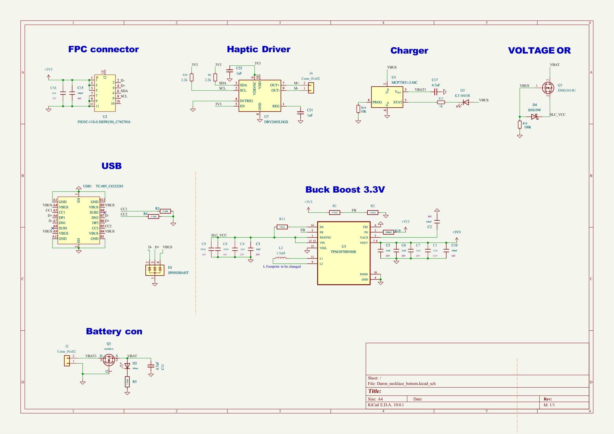
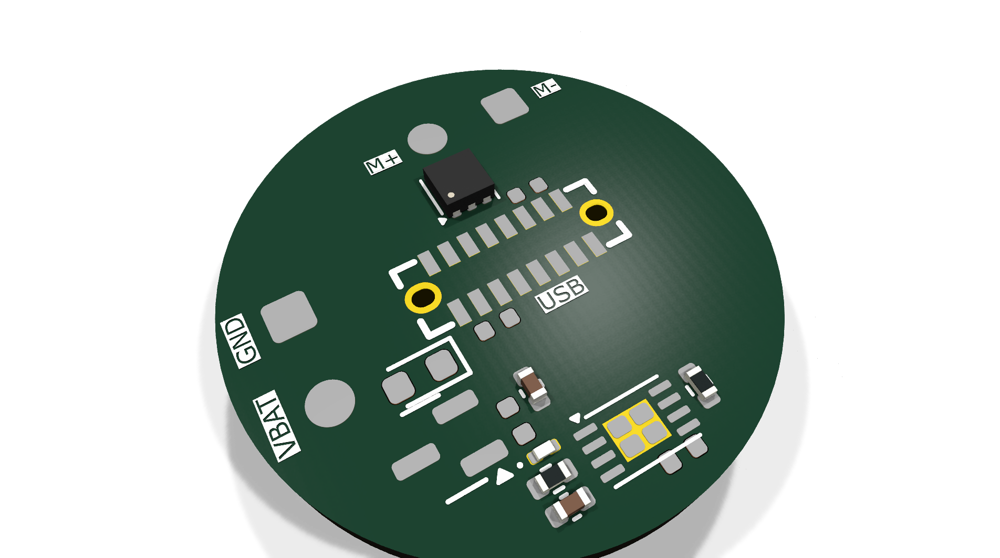
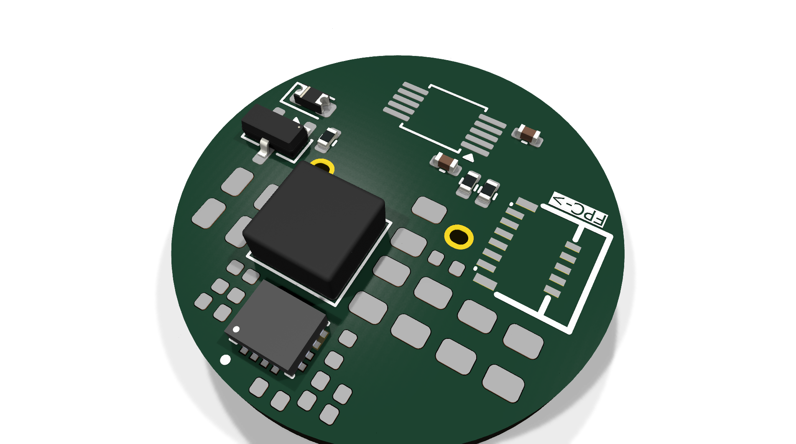

# Daron_necklace_bottom

Bottom half of wearable LED necklace - power, haptic, USB-C charging

## At a Glance

- **Status**: Routed
- **Board size**: 20 x 20 mm
- **Layers**: 2
- **Components**: 42
- **Key ICs**:
  - U1: MCP73831-2-MC
  - U2: FH35C-11S-0.3SHW(50)_C7427016
  - U3: TPS63070RNMR
  - U7: DRV2605LDGS

## Schematic

Full PDF: [reports/schematic.pdf](reports/schematic.pdf)

## Component Roles

- **TPS63070RNMR** (U3) - buck-boost regulator (3.3 V output); handles wide LiPo voltage swing
- **DRV2605LDGS** (U7) - haptic motor driver for tactile feedback
- **MCP73831-2-MC** (U1) - single-cell LiPo charger
- **AO3401A** (Q1) - P-channel MOSFET for power switching / load enable
- **DMG3414U** (Q3) - N-channel MOSFET (companion to Q1 for full PowerPath)
- **FH35C-11S-0.3SHW** (U2) - 0.3 mm-pitch FPC connector for the top-board flex link
- **TC-005** (USB1) - micro USB-C receptacle (compact variant)
- **SP0503BAHT** (D1) - 3-line ESD protection on USB data lines
- **KT-0603R** (D3) - status LED

> Companion to the top-board (LED-driving half). The top board handles the addressable LED chain; this board handles power, charging, haptics.

## PCB

**Top copper**

**Bottom copper**

## Bill of Materials

| Refs | Value | Footprint | Qty | MPN | LCSC |
|------|-------|-----------|----:|-----|------|
| C1 | 47uF | PCM_JLCPCB:C_0805 | 1 |  | [C16780](https://www.lcsc.com/product-detail/_C16780.html) |
| C2,C8-C10,C15 | 100nF | PCM_JLCPCB:C_0402 | 5 |  | [C1525](https://www.lcsc.com/product-detail/_C1525.html) |
| C3,C4,C16 | 10uF | PCM_JLCPCB:C_0805 | 3 |  | [C15850](https://www.lcsc.com/product-detail/_C15850.html) |
| C5-C7 | 22uF | PCM_JLCPCB:C_0805 | 3 |  | [C45783](https://www.lcsc.com/product-detail/_C45783.html) |
| C11,C17 | 4.7uF | Capacitor_SMD:C_0402_1005Metric | 2 |  |  |
| C21,C22 | 1uF | Capacitor_SMD:C_0402_1005Metric | 2 |  |  |
| D1 | SP0503BAHT | Package_SON:WSON-6-1EP_2x2mm_P0.65mm_EP1x1.6mm | 1 |  |  |
| D2 | White | PCM_JLCPCB:D_0603 | 1 |  | [C2290](https://www.lcsc.com/product-detail/_C2290.html) |
| D3 | KT-0603R | LED_SMD:LED_0201_0603Metric | 1 |  |  |
| D4 | B5819W | Diode_SMD:D_0603_1608Metric | 1 |  |  |
| J2,J4 | Conn_01x02 | Connector_Wire:SolderWire-0.1sqmm_1x02_P3.6mm_D0.4mm_OD1mm | 2 |  |  |
| L2 | 1.5uH | Inductor_SMD:L_Coilcraft_XAL4020-XXX | 1 |  |  |
| Q1 | AO3401A | PCM_JLCPCB:Q_SOT-23 | 1 |  | [C15127](https://www.lcsc.com/product-detail/_C15127.html) |
| Q3 | DMG3414U | Package_TO_SOT_SMD:SOT-23 | 1 |  |  |
| R1 | 470kΩ | PCM_JLCPCB:R_0402 | 1 |  | [C25790](https://www.lcsc.com/product-detail/_C25790.html) |
| R2 | 150kΩ | PCM_JLCPCB:R_0402 | 1 |  | [C25755](https://www.lcsc.com/product-detail/_C25755.html) |
| R3,R4 | 5.1kΩ | PCM_JLCPCB:R_0402 | 2 |  | [C25905](https://www.lcsc.com/product-detail/_C25905.html) |
| R5 | 2.2kΩ | PCM_JLCPCB:R_0402 | 1 |  | [C25879](https://www.lcsc.com/product-detail/_C25879.html) |
| R6,R20 | 2.2k | Resistor_SMD:R_0402_1005Metric | 2 |  |  |
| R11 | 10kΩ | PCM_JLCPCB:R_0402 | 1 |  | [C25744](https://www.lcsc.com/product-detail/_C25744.html) |
| R13 | 1k | Resistor_SMD:R_0402_1005Metric | 1 |  |  |
| R14 | 10k | Resistor_SMD:R_0402_1005Metric | 1 |  |  |
| R18 | 100k | Resistor_SMD:R_0402_1005Metric | 1 |  |  |
| R19 | 100kΩ | PCM_JLCPCB:R_0402 | 1 |  | [C25741](https://www.lcsc.com/product-detail/_C25741.html) |
| U1 | MCP73831-2-MC | Package_DFN_QFN:DFN-8-1EP_3x2mm_P0.5mm_EP1.7x1.4mm | 1 |  |  |
| U2 | FH35C-11S-0.3SHW(50)_C7427016 | FH35C_11S_0_3SHW_50_:FPC-SMD_FH35C-11S-0.3SHW | 1 |  |  |
| U3 | TPS63070RNMR | TPS63070RNMR:VREG_TPS63070RNMR | 1 |  |  |
| U7 | DRV2605LDGS | Package_SO:VSSOP-10_3x3mm_P0.5mm | 1 |  |  |
| USB1 | TC-005_C6332285 | usbc:USB-C-SMD_TC-005 | 1 |  |  |

_17 of 29 line items don't have an LCSC code in the schematic - search [LCSC](https://www.lcsc.com/) or [JLC parts search](https://jlcsearch.tscircuit.com/) by MPN or footprint when sourcing._

## Files

- `Daron_necklace_bottom.kicad_pro` - KiCad project
- `Daron_necklace_bottom.kicad_sch` - schematic source
- `Daron_necklace_bottom.kicad_pcb` - PCB layout source
- `reports/schematic.pdf` - full schematic (printable)
- `reports/bom.csv` - bill of materials
- `reports/pcb-top.svg`, `reports/pcb-bottom.svg` - copper artwork
- `reports/board-stats.json` - KiCad-generated board statistics

---

_Renders and metadata auto-generated by `Backup-KiCadProject.ps1` using KiCad 10.0._

